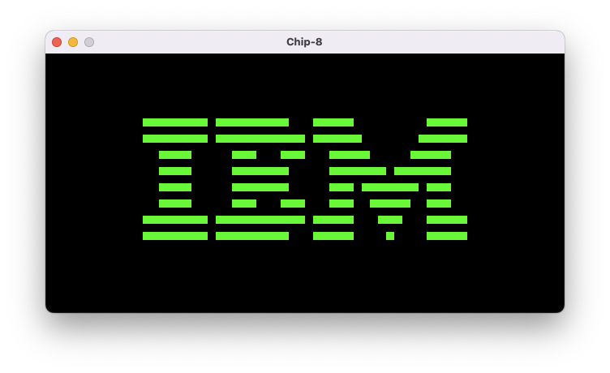
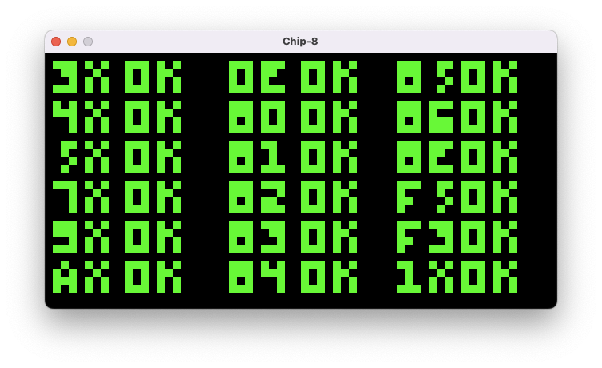

# CHIP-8 Emulator
### A Chip-8 Emulator written in Rust


____



## Build and Run
Required packages
* [rand](https://crates.io/crates/rand)
* [SDL2](https://crates.io/crates/sdl2)

Build and run with Cargo.
```
cargo build
cargo run
```

Free to use ROMs are found in the roms directory.

## Issues
Sound is not yet implemented

## Useful Links
* [Chip 8 Reference](http://devernay.free.fr/hacks/chip8/C8TECH10.HTM)
* [Chip 8 Explanations](https://tobiasvl.github.io/blog/write-a-chip-8-emulator/)
